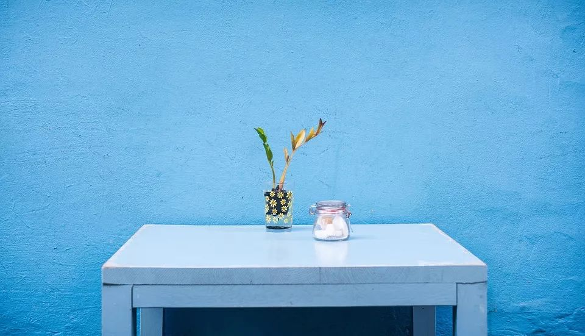

# 08-【培育觉察力】看见更多的色彩

**看见更多的色彩**

**请你拿出一张纸，或者用你的手机，记录下你周围环境中，所有的蓝色物体。这不是一个任务，也不是考试，所以，请放松你的心态，当蓝色自然的出现在你眼前时，你就记录下来。**

现在，就请你去寻找蓝色吧！

你可以一边找，一边听我说。像是我现在就看到，我面前的监听喇叭的LED灯是蓝色的。我身边的原子笔，是蓝色的还有一包口香糖，包装是蓝色的。

你是否发现，原来我们的生活中，所在的环境中，竟然有这么多的蓝色。你也可能会惊讶，为什么之前就没有注意到呢？因为我们的注意力广度，大多数时候，都因为眼前聚焦的事物，而被缩窄了。

比如今天刚到公司，主管就交给你一个任务，做一份PPT，页数很多，时间很急，下午两点前必须做完，那么，你这一上午都会盯在这件事上，在网上搜集图片，编辑文字，思考视觉呈现，排版……可能连午饭都是边盯着屏幕边吃完的。

那么，在这段时间里，你可能都没有留意到，桌上的小植物，今天开花了；后面工位的同事，今天请假没来；办公室的空调声音很大……这些事情都在同时发生着，而你因为专注于眼前，就忽略了当下其他的变化。甚至可以这么说，在你今天的世界里，这些事情，并没有真正发生过。

那我问你一个问题： 

以整个人生的幅度来看，如果你的注意力，总是在眼前不断纷至沓来的事情上，总是只看到眼前这个小小的空间，所思所想也都是眼前的这些事情上，那么，你的整个生活，还剩下多少，是留给你自己的？你对这个世界的感受，是不是就只剩下一堆外部的事情，一堆因为这些事情而牵扯而起的更多的事情？你有多少时间是留给自己，去感受这个世界的丰富，和自己内心的变化的呢？

所以，当你去寻找蓝色时，你会发现，原来生活中有那么多蓝色，而你几乎没有觉察到。同时，你也「邀请」了更多的色彩，进入了你的生活中，你可能也没有察觉到。你会发现，原来你是生活在这样一个空间里，你的世界，原来是这个样子的。

与此同时，你的身心，也因为跳脱出原先的状态，有那么短短的一段时间，是属于你自己的，是回到了你的当下。所以，有了一些新发现，有了一些小感悟，也恢复了一些心理的弹性。

这就是今天的正念训练。

希望让你忙碌的周一，有一个安静的收尾，有一份属于自己的空间。