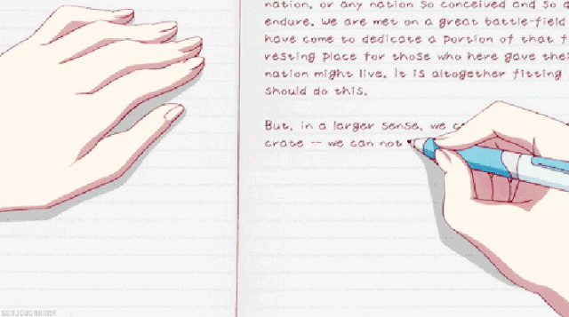

# 10-【培育觉察力】使用你的「不习惯」

**使用你的“不习惯”**

**在接下来的20分钟内，请你无论做什么事情，都使用你的非惯用手。**

比如你习惯了用右手，那么，在接下来20分钟内，就请你一直使用左手。如果你习惯用左手，那么就请你接下来使用右手。

也许你现在准备洗漱睡觉了，就请你用你的非惯用手来刷牙、取毛巾、拧开或关闭水龙头；或者你接下来要拿一本书准备阅读，请你用非惯用手来固定和翻页；或者你正和家人看电视，或者和小孩子玩游戏，也请你用非惯用手来操控电视遥控器、搬动桌子椅子或者收拾小孩子的玩具。

一开始你可能会觉得有点不适应，或者一不小心又用熟悉的那只手了，没关系，你可以在手背上，贴上一张小小的贴纸，或者系上一根细细的带子，当你发觉不由自主的又用了惯用手，就换成另一只手。

等你练习完毕后，我们再回来继续。

现在，感觉如何？当你开始使用另一只不那么顺手的手时，有什么不同的感觉吗？

是否突然觉得自己非常的笨拙，很多动作都没法顺利的完成，就好像回到了小时候，刚刚开始学习用筷子、或者刚刚学习电脑键盘打字时，那种笨手笨脚的、非常不灵活的样子。

好好的感受一下那种笨拙，手上和心理上的那种不适感，是不是很久没有体验过了？

其实，这就是**习惯的力量**。正因为**我们在长期的生活中，积累了很多的习惯，让很多事情都能够下意识的几乎本能的去完成，那么，我们就很容易就忽略了，在我们的身上，其实还有很多笨拙的、处于初始阶段的状态。**

因为用不到，所以被忽略了，除非有一天，我们不得不用到另一手时，才突然发现，那只手，可能从我们两三岁时，就没有再进步过，还保持着几十年前的笨拙的样子。

而我们的生活，何尝不是如此呢？当我们习惯了每天的忙忙碌碌，习惯了和家人、和朋友的某种互动模式，还有很多从年轻时就保持的生活的喜好和方法时，你有没有发现在这些熟悉的习惯之外，**生活中还有很多笨拙的、初级的、可能需要你去增强的地方。那可能是你从小就不太擅长的，或者常常有意无意逃避的，或者你内心里比较排斥的？**

去想一想，有哪些，是否从现在就改进它，锻炼起来，让它变得更加熟练和强大。

相信我，这会对你的生活有很大帮助。

这就是今天的正念训练，我们下周见！