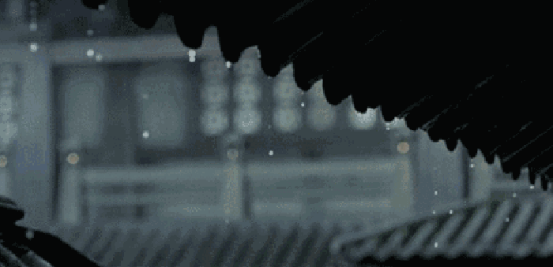

# 14-【释放压力】为你的耳朵松绑

**为你的耳朵松绑**

**请你停下手边的事情，找一个舒服的地方，坐下来，静下心来，倾听周围环境中的声音。**

一开始，你可能会听到很多混杂在一起的声音，好像周围有一大团的、没有形状又无处不在的声响，然后，慢慢的，你会发现，不同的声音开始显示出它们自己的轮廓，逐渐变得清晰起来。

家人走路的脚步声，厨房里传来的洗碗声，窗外的孩子的嬉闹声，还有空调吹风的声音，远处车辆的行驶的声音，等等。

**就这么安静的聆听，保持安静的心态，继续聆听。**

 然后，你可能会发现很多声音的细节。原来这些声音并不是一个简单的直接的声响，还有不同的层次、先后的顺序，有高低起伏的细节，都融合在一起，成为你身边的一个存在。

**现在，我要请你做一件事：请你不要试图「辨识」这是什么声音，也不要去思考声音是从哪里来的，是什么形状的，也不要去想这些声音是否嘈杂、吵闹，就让声音自然的进入你的耳朵，用你的听觉去捕获这些声音，不加分辨、不加批判、不加情绪的聆听。**

就好像回到婴儿时期，当我们的听觉第一次启动，新世界的声音第一次进入我们的耳朵一样，所有的声音都是陌生的，是新鲜的，我们**以一颗初生的心，毫无拒绝的接受着这些声音**，并且，开始用听觉探索这个新的世界，延伸到这个世界的每一个细节。

请你保持这个初生的心，一分钟，或者两分钟，去感受这个世界的所有声音。让自己保持和缓的深呼吸。如果你发现自己的注意力被某一个声音吸引，没有关系。轻轻的放开它，让专注力回到自己的呼吸上。逐渐的，你会发现其他背景的声音又会再一次浮现出来。

 

听觉，是我们获取信息的重要通道，而它并不是从小一成不变的。婴儿期的我们，有着比现在更加敏锐的听觉，能够分辨出许多细微的不同的声音。

而随着我们的成长，大脑需要处理的信息越来越多，我们就会开始有意识的屏蔽或者钝化一些外界的声音，只保留我们当下关注的声音，并且我们开始习惯这个被大脑处理过的环境。

一方面，这会让我们不太受环境干扰，能够保持做事情的专注力；但另一方面，这其实也钝化了我们对环境的敏锐度，以及对于当下的心灵连结和体会。 

**当我们总是被外界牵走注意力，乃至忽略了自我的觉察力时，我们便更容易失去我们生而为人的独立性和存在感。**

尤其是今天越来越忙碌的生活里，我们太过于关注各种带着讯息的声音、提醒的声音、提示的声音、警告的声音。我们认为那些声音是重要的，但如果你仔细听，你会发现有好多声音在同时发生，谁说哪个声音是最有意义的呢？

所以，**今天，希望你能够通过聆听，让自己的心得到安静，也重新发现自己的听觉，发现一个被我们忽略的世界。**

祝你的身心，在经过一天忙碌之后，能够找到属于自己的空间，找到自己的平静，在聆听之中，享受当下的喜悦。