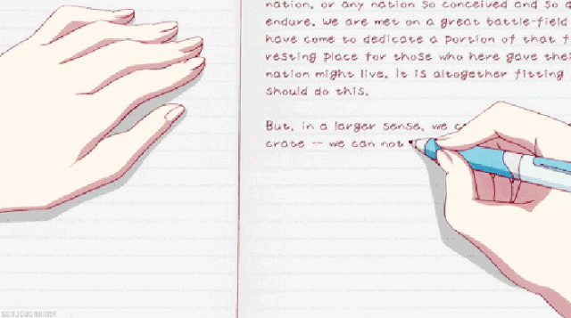

# 21-【调整心态】感恩身边的善意

**感恩身边的善意** 

**请你拿出一张纸、一支笔，或者就用你的手机里的便签，写下今天让你心存感激的三件事情。**

你可能会觉得，哪有那么多值得感激的事情，但当你开始回想，开始落笔的时候，我相信，你一定能够回忆起今天这一整天里，有不少值得感谢的人或事。即便是你觉得，今天某些事情进行得很顺利，光是这一点，可能就值得感谢了，虽然没有实际感谢的对象。

当你写完后，如果你愿意分享，可以把感恩笔记发布在下方的留言区，也可以分享给最亲密的朋友或家人。当写完之后，我们再来继续。

 

 

欢迎回来，我们继续今天的正念训练。

常听说一句话，叫「学会感恩」，为什么要感恩呢？要怎么感恩呢？

**所谓感恩，不仅是对那些帮助我们的人，有感激之心，感恩之举，你还应该主动去发现那些应该感恩的人和事，常常保持着一颗感恩的心。**

因为我们常常会忽略掉那些事，就像刚才你写下的三件值得感激的事情，如果没有人告诉你要写下来，你可能都没有意识到，原来今天有这么多人和事，为我提供了帮助，对我有助益。那么，拓展开来，我们的生活一天天过去，会有更多值得感恩的人和事，是被无意中忽略掉的呢？

**人常常有这样一种心理特点，就是趋利避害，对于好的事情，会主动靠近，而对于不好的事情，会本能避开；但是在另一面，人又往往习惯于思考、强调不好的事情，而忽略了那些好的、正向的事情。**

举例来说，我们常常会想，「早知道是这样，当初我就不应该……」「今天工作太枯燥了，为什么要给我安排这个工作……」 

这可能是出于人本能的一种自我保护的机制，思考负面的可能性，躲避潜在的危险，让我们常常会从一个负向的视角，去看待我们一天的经历，去自省、去反思、去总结。

但是，**当你长时间处于这样的一种负向心态时，你的不安全感、焦虑感和挫败感，会大大影响你的心理状态。**

**对治的方法，就是不要习惯于被负面情绪和思考牵着走，要主动的、甚至是刻意的看见生活中那些正向的事情，从一个正面的角度，肯定和感激那些为我们提供助力，提供正面情绪的人和事。**

**只有当你开始善于发现生活中好的一面，常常能感受到正向的力量，一开始可能是刻意的，慢慢的，这变成了你的一种基本思维方式后，那么，你的心理状态、情绪和思想，都会朝着平衡而强健的方向进步。**

而感恩笔记，是一个很好的方法，来帮助你发现生活中那些正向的、美好的事物，让你的心理花园里，不仅除去杂草，还种满了鲜花。

你也可以拿出一周乃至一个月的时间，每天晚上做一次感恩笔记。我相信你一定能感受到自己心态的正向变化 。

祝福你，心怀感念之下，有个美好的一周。