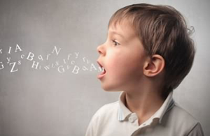

# 24-【调整心态】聆听自己的两种声音

**聆听自己的两种声音**

**我们都知道，沟通时，「非语言」的讯息也是很重要的。比如语气、语调，音高等等。**但在今天这个练习，我们就只专注在一个面向，那就是说话的节奏。

**今天一整天，或是接下来一整天，请你特别去留意，自己和别人在交谈时的说话节奏。**是平稳的，还是忽快忽慢的？是急促的，还是和缓的？有个舒服的自然律动，还是像菜刀切菜一样咄咄咄的？

请你特别去留意，但不要带批评，也不要猜测「为什么」这个人讲话会是这个节奏。只是去注意，然后接受。把思考的时间，留在一天结束的时候。然后，**晚上，找个安静的地方，静静的坐着，倒带回想你今天所观察到的细节。**

**说话的节奏，反映了我们内心的状态，也反映了周遭环境的状态。**

我在主持现场广播节目时，每当节目要进入广告时间，制作人就会开始用手在空中「画圈圈」。看到他在画圈圈，我们就要加快速度收尾。

在与别人交谈时，我们当然不会用画圈圈这么明显的手势，虽然有时候可能很想这么做。但**无论你是否有明显的举动，我们仍然可能在声音上，不经意的传递出许多讯号，**当我们听得不耐烦时，对方似乎也能感受到我们的不耐烦，语气也会变得急促起来。当我们比较轻松自在时，对方的语气也会比较平和。

别人会受我们的影响，我们也会受别人的影响，很少人在交谈时，是完全不受影响的。其实你跟这种人说话，就像是跟一个墙壁说话一样，感觉也不是很好。毕竟「对话」就是要一来一往，这个讯息的交流是非常多层又微妙的。

如果你想要更进阶的体会，试试看：跟别人讲电话的时候，把自己的声音录下来。

大多数的人都不习惯听到自己的声音，但只要你敢尝试，肯定会很有收获。你可能会很惊讶，自己说话的声音在与别人交谈的时候，能够有那么大的变化。

而如果你能够记得，当时说某句话的时候，自己心里的感受，也可能会发现很大的落差，比如某些你觉得说得很快的地方，其实你说的很慢。

为什么呢？原因有很多。

那些听起来很慢的话，可能正是你在深思熟虑的时候说的，所以你并不觉得自己说的慢，因为你正在忙着思考。也许你脑袋里有一堆话，但你实际只说出来几个字。当你回放录音，你会发现，脑袋里的声音世界与我们表达出来的声音世界，可能有相当的不同。

你说哪一个声音，才是真实的呢？

其实，两个都是真实的。一个是内观的真实，一个是外观的真实。**接受这两者都是并存的现实，是一堂很重要的自我成长课题。我们的内在与外在的声音，我们在接收与传递之间的影响，使每一个交谈的当下，都是个千变万化的共同创造过程。**

今天，就让自己用这个正念训练，来察觉那对话节奏中的奥妙。