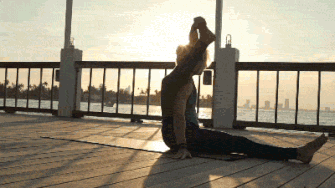
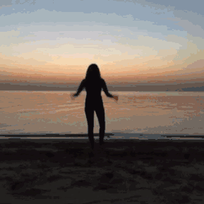

# 26-【养护身心】调整合适的姿势

**调整合适的姿势**

**现在，无论你是什么姿势，坐着，躺着，或者走着，请你先停下其他事情，检查一下身上每个部位的感觉 ，你的颈椎，你的肩胛骨，腰部，你的胸口，膝盖，从头到尾检查一遍，看看这些地方是否紧张，是否有不适感。**

**如果有不适感，请你主动调节，把紧张的肌肉放松，把不舒服的姿势，调整成舒服的姿势**。在接下来一直到睡觉前，请你都保持这样的觉察，去注意到自己身体姿势的不舒服之处，然后进行调整。

**你也可以请家人来协助你，不时的留意你的姿势，提醒你进行调整。**

 

身体，是我们所有生命活动的基础，但我们常常会忽略它。无论是一天的工作、学习，还是回到家，做饭，收拾东西，和孩子玩耍，我们的注意力往往在眼前的事情上，而没有意识到，我们身体的变化。

**它不仅在持续提供给我们能量和精力，还承受着我们所有活动给它的影响。**

比如说，我们的身体姿势。

你可能没有留意过我们的身体在各种姿势下的状态，就像刚才我们做的那些检查，身体部位已经不舒适了，但我们并没有察觉到，而身体也就默默承受下来了。

问题在于，我们从小到大养成的姿势，可能都是一成不变的，比如你躺在沙发上看电视的习惯，附身在桌上看书的习惯，低头走路的习惯，跷二郎腿的习惯，工作时窝在工位上的习惯，等等。

这些姿势都会让我们身体的一些部位，产生长期的压力和不舒适感，但因为这些感觉都是轻微的，没那么明显，也因为我们现在还年轻，身体还能够承受这些，所以常常会忽略掉这些感觉。

但日积月累下来所造成的改变，会超出我们的想象。当我们生病时，或者不再年轻，不再强健，身体就会提醒我们，这里或者哪里，已经出现了问题，而且往往是积重难返的问题。

**从另一方面讲，身体姿势不仅关系到我们的健康，还影响着别人对我们的观感。**这一点，想必大家都有所体会。面对面聊天时，一个姿势挺拔的人，和一个缩头缩脑的人，完全会产生截然不同的评价。 

而身体的小动作、不友善的姿势，比如二郎腿、冷肩斜对、后仰还是附身，都会给另一方带来不同的观感，影响着对你的评价。

**而从具身认知心理学的研究发现，人的生理行为，往往和心理状态联系到一起，身体的感觉和你的认知会交叉影响。** 比如一个习惯窝着身体、低头走路的人，往往在社交中处于劣势，也不太擅长和人打交道。再比如你抬起头时，就不太容易想起难过的事情，低下头时，就不太容易想起开心的事情。 

这很奇妙。

 

理论研究就不展开讲解了，只要记住，**正确的身体姿势，不仅仅关系到我们的健康，还和我们的人际交往、心理状态都有关联，**所以，请你认真体验今天的正念训练，去检查和发现自己平时忽略掉的身体感觉，并进行调整。

希望从今天开始，你能够意识到自己的身体，并主动开始改变一些习惯。 

最后，今晚睡觉前，也请你躺好之后，先把身体调整到一个舒适的姿势，再入眠。

谢谢你的参加。我们下周见！