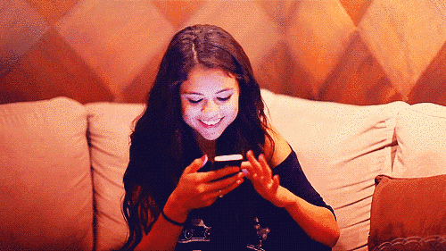

# 17-【释放压力】收回你的注意力

**收回你的注意力**

**请你先找出一张纸，列出日常生活中所有的新闻来源，比如电视、广播、手机上的app、社交网站、朋友圈，短视频网站等等。**

**整理完毕之后，请你给自己一整天的时间，不去接触任何新闻，也不参与同事或朋友之间的对新闻事件的讨论，照常过自己的生活。** 

如果你是个新闻控的话，那这个训练，可能会一开始很不舒服，但请你一定要去尝试，把这些新闻信息全都屏蔽在外，必要的话，关掉朋友圈，关掉电视，让自己回到工业时代之前那样，没有现代媒体，也没有互联网，去体会一个信息清静的世界，是什么样子。

很多人可能没有想过这个问题：我们每天接触这么多的信息，这么多的新事物，是从什么时候开始的呢？

其实并不久远，就是最近一百多年的事情。伴随着工业革命，现代传播开始兴起，以报纸、广播、电视，到现在的互联网，为我们每天提供大量的信息、报导、事件，供我们进行一种精神上的消费。

**但想一想，这些信息，真的是我们需要的吗？你每天看的新闻、段子、网红直播、各种微知识、各种新发现，但如果你不知道它们，会对你的生活，产生什么样的影响呢？**

我自己从事媒体工作许多年，所以我知道，媒体是一个产业。你想，那么多新闻台为什么可以整天采访新闻，播给你看？这不仅是社会服务，而是一个商业模式。伴随着新闻，你获得了消费讯息，看了广告，增加了购买东西的愿望，这些都是媒体希望造成的。他们拥有你的专注力越久，他们就越赚钱。

所以，现在的新闻已经越来越娱乐化，越来越「重口味」了，从耸动的标题到尖锐的声音和鲜艳的画面色彩，整个的设计就是要你很难不注意它。

**但人的注意力是有限的。多看手机一分钟，就少陪家人一分钟。你可能不觉得这算什么，直到你有一天刻意把这些时间都抓回来。这就是今天这个练习的目的。**

 

**今天的练习，不是叫你戒掉新闻，而是让你观察自己的注意力，有多少已经被所谓的新闻瓜分。我相信，当你把这些媒体信息的声音，挡在自己的世界之外，反而会让自己的生活，变得更加专注，更加的真实。** 

**在以前，我们人都是跟随着自然的律动，紧贴着大地过日子，我们的生活习惯、肢体感受，是和整个自然、和我们自己的生命一起运行的，当我们在和一个人交谈时，我们真的就是在交谈，也能够非常明确的感受到对方的存在。当我们做事时，也真正就是在做事，我们的心思、专注力，都会放在当下，放在该放的位置。**

但现在，我们却常常生活在别处。我听过一个最夸张的例子，是有人一边开着电视看新闻，但是低头玩着手机游戏，同时旁边还放着一个ipad，播放着最近热播的电视剧和综艺节目。

**我们的身体生活在当下，但我们的心理，我们的思想，却总在其他的地方，这种身心分离的状态，时间久了，会给我们一种莫名的空虚感，会让我们觉得，生活变得好满，好匆忙，也会莫名其妙的感到对生活不满足。**

而脑科学的研究也发现，当我们习惯寻求「及时行乐」类型的刺激时，我们的多巴胺的活性会超出正常的水平，在大脑中的反应，会出现负责决策、控制、认知的部分活性开始降低，而负责行动的边缘系统活性开始增强，也就意味着**我们会变得更加冲动，同时我们的耐心、自控力也都会下降。** 

所以，今天的正念训练，就让我们从这种状态中跳脱出来吧，把我们的注意力，放回到我们的日常生活本身，吃饭时吃饭，运动时运动，读书时读书，睡觉时睡觉。 

让我们的心，回到当下，让我们拥有一个真实的、不被打扰的世界。

感谢你的收听，也欢迎你告诉我你的感受。