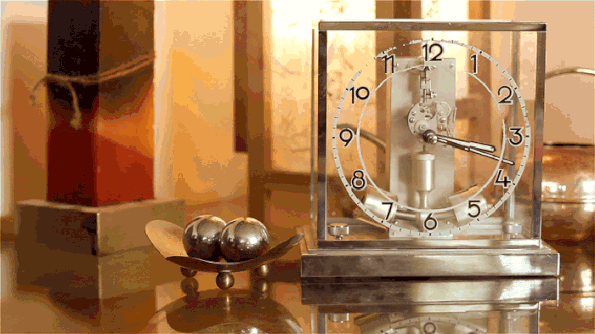

# 18-【释放压力】观察时间中的身心

**观察时间中的身心**

请你拿出**至少三天的时间**，来做这个练习。

**在这三天内，无论是与人约会、聚餐、一起看电影，还是自己的工作、学习安排、健身计划，都请你做到绝对守时，在该做一件事的时候，就让这件事发生，该出现在一个地方时，就到那里。**

在平常日子里，我们都会遇到迟到的情况，每次可能都有不同的原因，毕竟现代生活里，每个人都很忙碌，难免会遇到事情耽搁。但在我请你刻意练习「守时」，让自己完全不迟到。

这可能会是一个很大的挑战，也许你会需要多做许多准备，例如用清单或行事历，或是出门前规划路线和车程时间，才能确保自己完全不会迟到，这都是练习的一部分，因为可以帮助你更了解自己的习性，以及你所面对的生活变化。

如果你没做到「守时」，不小心迟到了，或拖延了，也请你深刻体会当下的那种感觉。你可能因为按时到达，心态比较放松。也可能因为迟到而有点焦急，但还有可能，因为你比开始时间早到了一点，不得不和现场的其他人寒暄，而这并不是你所喜欢的；还有可能遇到一个你并不想参加的会议，你虽然准时到达了，但内心是抗拒的？ 

无论守时还是迟到，每个人都会有不同的当下的感受。

**但无论是什么感受，都请你后退一步，去观察这些感受，并以此做为一个锚点，往前去追溯，为什么我会有这样的感受？**可能会有各种各样的念头和想法涌现出来，不管是什么念头，请你都不要被这些它们带走，你要做的，只是安静的去观看它们。

你会逐渐清晰的了解，自己当下的这个感受，是如何从过去的生活中，一路抵达现在。可能是因为你就是一个喜欢守时的人，事情的确定性越高，给你的正向反馈就越多，所以，你很享受这种一切尽在掌控的感觉；或者是因为你在最近一段时间，工作任务太多，导致时间非常紧张，而你也堆积了许多未完成的事情，更让你手忙脚乱；还有可能是早晨出门，遇到了不在计划中的一些事情，导致你耽搁了时间，影响了一天的心情，等等。

**当你找到当下的感受和你的内心、你的经验之间，那些真实的连结，你就能够更加真切的感受到，是什么影响了你当下的身心状态，从而在下一次需要守时的事情上，做出选择，做出调整。**

 

**我们利用了「时间」这个坐标，来认识我们不断变化的身心，在变化之中，找到不变；在变化之中，学会应变。**

当你完成这几天的正念训练，我相信你的时间观念，和对应的生活工作状态，一定能够有所改善。

期待你的进步与改变，我们下次再见！