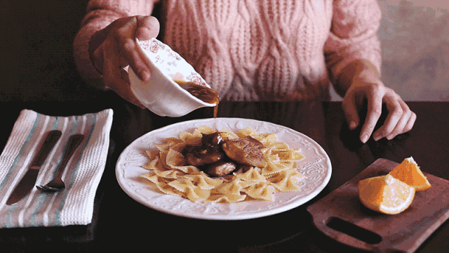
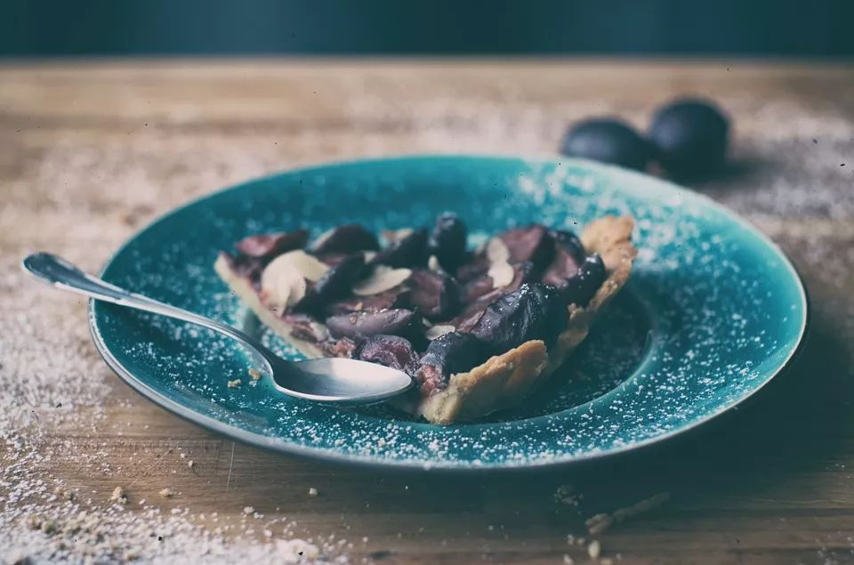

# 20-【调整心态】让你的味觉慢下来

**让味觉慢下来**

 

**如果你还没有吃晚饭，记得提醒自己，在吃饭时，每吃一口，就放下筷子和汤匙，先把口里的食物，充分的咀嚼，咽下之后，再去吃第二口。**

**如果你平常都吃得很快，没办法做到充分的咀嚼，那就给自己设定一个规则：每一口，都咀嚼30下，再吃第二口。**

**在吃饭的同时，请你将手机放在比较远的地方，也不要看电视、平板等任何会分散你注意力的东西，也不要和别人交谈**。就聚精会神的吃饭，认真的吃完这一餐，品尝食物的滋味，甚至感受食物吞下去之后进入食道，从触觉意识中消失的那一刻，留意你的胃，逐渐被食物填满的感觉，留意那饱足感，是逐渐堆积起来的？还是突然发现自己饱了的？

如果你已经吃过饭了，先记下这个训练方式，下次吃饭时，再来做这个练习。

不要觉得这个训练很简单，实际上，等你真正在吃的时候，你会发现为什么控制不住自己，往往嚼了几口之后，就想吃第二口了，盲目的往嘴里塞东西；而且等不及把食物充分的咀嚼，品尝到它的滋味，就已经迫不及待的往下吞咽了；甚至我们会在嘴里连续塞几种不同的食物，味道全都混在一起……

回想一下，好像每一次吃饭，我们都很着急的把饭吃完，狼吞虎咽，胡乱的吃一顿。可是，到底有什么着急的事情，让我们急于吃完呢？如果真的那么着急，为什么我们多数的时候，还会同时刷手机、看视频呢？ 

似乎在吃饭的时候，「吃饭」变成了最不重要的事情。 

但显而易见，这是不那么「合理」的。吃饭是我们一天中，最重要的补充能量的方式。如果不能好好的吃一顿饭，我们的精力会收到影响，我们的肠胃也会抗议。 

当你急匆匆的吃饭，或者边看手机边吃饭时，你往往意识不到自己吃进了多少食物，当大脑传来信息，让你意识到自己已经饱了，此时你可能已经吞下了过量的食物。

当你连续多日，甚至常年累月的「胡乱」吃饭时，吃饭对你来说不再是一种味蕾的愉悦，反而变成了任务，变成了一种负担，这让你的生活失去了应有的一些均衡状态。

**今天，请训练自己「细嚼慢咽」，去感受食物的味道，去认真专注于咀嚼，请仔细品味这整个过程中，你的身体由饥饿转向满足进而感到喜悦的滋味。就像我们小时候，没有电视、没有手机，和家人认真吃的那一顿饭。**

这就是今天的正念训练。